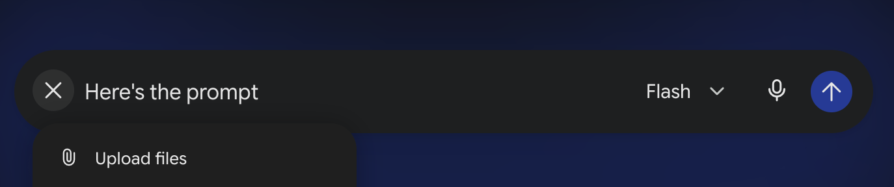

# AGENTS.md — FlipFlopper

Cross-tool AI agent instructions (read by Claude Code, Codex, agy, Cursor, Aider, etc.
via the Linux Foundation AAIF standard).

## Screenshot



## What this project is

**FlipFlopper** — a cross-platform desktop app (Tauri 2 + SolidJS) that wraps CLI AI coding
agents (Claude Code, Codex, agy, Aider…) in a better GUI:

- Real embedded terminals (PTY via `portable-pty`) per agent
- File tree with checkbox selection → `@file` injection into the agent
- Tool installer (scrcpy, chromium, adb…)
- Webview preview for dev-server changes
- Git auto-commit on the `ai-work` branch
- Agent handoff via `cli-continues` (switch Claude → Codex mid-session)
- Shared config for every agent per project via AGENTS.md + `.agents/`

## Stack

- **Backend:** Rust + Tauri 2 (`src-tauri/`)
- **Frontend:** SolidJS + Vite + TypeScript (`src/`)
- **Key crates:** `portable-pty`, `which`, `ignore` (ripgrep), `dirs`, `tauri-plugin-dialog`
- **Key npm packages:** `@xterm/xterm`, `@xterm/addon-fit`

## Build & dev

```sh
npm install            # frontend deps
npm run tauri dev      # start dev mode (compiles Rust + hot-reloads frontend)
npm run tauri build    # production build
```

Rust checks: `cd src-tauri && cargo check`

## Architecture notes

```
src/
  App.tsx              — three-pane layout (sidebar | terminal tabs | right panel)
  lib/ipc.ts           — all Tauri invoke() wrappers (typed)
  lib/store.ts         — SolidJS store (global UI state)
  components/
    AgentBar.tsx       — tab bar for running agent sessions
    TerminalPane.tsx   — xterm.js terminal connected to a PTY session
    Sidebar.tsx        — project picker + file tree host
    FileTree.tsx       — .gitignore-aware file tree with @ref injection
    ToolInstaller.tsx  — curated tool catalog with per-OS install commands
    PreviewPane.tsx    — webview preview + git commit panel

src-tauri/src/
  pty.rs               — PTY session manager (spawn/read/write/resize/kill)
  agents.rs            — agent registry + installed status detection
  project.rs           — .agents/ + AGENTS.md scaffolding, file tree lister
  git.rs               — git status + auto-commit (shell-based)
  tools.rs             — tool catalog + per-OS install command resolution
  handoff.rs           — cli-continues wrapper for agent switching
  lib.rs               — Tauri Builder + all #[tauri::command] handlers
```

## Conventions

- **Commits:** imperative, specific, scope-prefixed — e.g. `feat(pty): add resize support`
  Always commit to the `ai-work` branch, never directly to `main`.
- **Rust:** `cargo check` must pass before committing; suppress dead_code warnings with `#[allow(dead_code)]` only if genuinely needed.
- **TypeScript:** `npx tsc --noEmit` must pass.
- **Error handling:** Tauri commands return `Result<T, String>` — surface the String to the user, never silently swallow.
- **No new files without discussion** — ask before adding crates or npm packages.

## File reference convention

Use `@relative/path` (relative to the project root) when referencing files in agent prompts.
Line ranges: `@src/pty.rs:42-60`.
